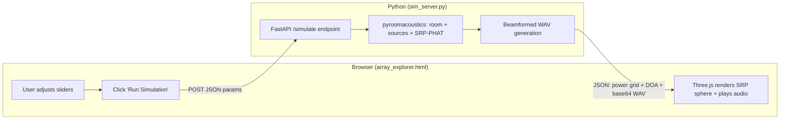

# Live Simulation Server + Explorer Integration

## Pre-requisite: Fix corrupted run_comparison.py

Line 24 of [run_comparison.py](c:\Users\rizqi\Projects\acousticsim\run_comparison.py) reads `iis it` -- this wiped out the constants block and matplotlib import. Before anything else, restore the missing definitions:

```python
import matplotlib
matplotlib.use("Agg")
import matplotlib.pyplot as plt

FS = 16_000
NFFT = 1024
HOP = 512
FMIN = 200.0
FMAX = 2000.0
C = 343.0
```

## Architecture



## 1. New file: `sim_server.py` (FastAPI backend)

Single Python file in the project root. Reuses geometry builders from `run_comparison.py` via import.

**Endpoint: `POST /simulate`**

Accepts JSON body:

- `geometry`: "UCA" | "CROSS" | "ULA" | "CYLINDER"
- `mic_count`: int (4-32)
- `radius`: float (meters)
- `ring_separation`: float (Cylinder only)
- `room_dims`: [length, width, height] -- defaults [50, 40, 12]
- `rt60`: float (0.0 to 2.5) -- 0 means anechoic
- `source_az_deg`, `source_el_deg`, `source_distance`: drone placement
- `snr_db`: float (-20 to 30)
- `diffuse`: bool -- crowd + PA noise
- `crowd_count`: int (0-50) -- number of crowd noise sources
- `pa_count`: int (0-12) -- number of PA sources

**Processing logic** (mirrors `run_single_trial` from `run_comparison.py`):

1. Build mic array from geometry params (call `make_uca`/`make_cross`/`make_ula`/`make_cylinder` with custom mic_count and radius)
2. Create room (AnechoicRoom or ShoeBox with `inverse_sabine`, `max_order` capped at min(computed, 6) for large rooms)
3. Add drone source at specified position
4. If diffuse: add crowd sources (random perimeter positions at z=1.5m) and PA sources (random positions at z=3.0m near walls)
5. Simulate, compute STFT, run SRP-PHAT on 72x19 grid
6. Beamformed audio: apply delay-and-sum toward estimated DOA direction, sum channels, normalize
7. Encode beamformed WAV as base64 string

**Returns JSON:**

- `power`: 19x72 nested array (colatitude x azimuth)
- `est_az_deg`, `est_el_deg`: estimated DOA
- `true_az_deg`, `true_el_deg`: ground truth
- `mic_positions`: [[x,y,z], ...] for rendering
- `audio_b64`: base64-encoded 16-bit WAV of beamformed output
- `elapsed_s`: computation time
- `params`: echo of input params for display

**CORS middleware** enabled for `localhost` origins.

**Dependencies to install:** `fastapi`, `uvicorn`

## 2. Modify `run_comparison.py` geometry builders

Refactor `make_uca`, `make_cross`, `make_ula`, `make_cylinder` to accept `mic_count` and `radius` as parameters (some already do, `make_cross` and `make_cylinder` need their param names aligned). The existing `build_geometry(name, center)` wrapper stays for the sweep. Add a new `build_geometry_custom(name, center, mic_count, radius, separation)` that `sim_server.py` calls.

## 3. Modify `results/array_explorer.html` -- add "Live Simulation" mode

**New UI elements:**

- Third toggle button: **"Live Sim"** alongside "Beam Pattern" and "SRP Simulation"
- `#liveControls` panel (visible only in Live Sim mode) with sliders/inputs:
  - Geometry selector + mic count + radius + ring separation (reuse same sliders as beam mode)
  - Room: length (10-100m, default 50), width (10-80m, default 40), height (4-15m, default 12)
  - RT60: 0.0-2.5s, default 1.5
  - Source: azimuth (0-355), elevation (-90 to 90), distance (2-20m, default 6)
  - SNR: -20 to 30 dB, default 0
  - Diffuse toggle checkbox, crowd count (0-50, default 30), PA count (0-12, default 8)
- **"Run Simulation" button** -- does not auto-fire on slider change (too slow)
- **Loading spinner** overlay while waiting for server response
- **Audio player**: small `<audio>` element with play/pause, appears after simulation completes

**Rendering logic:**

- On response, display the returned `power` grid on the same 3D sphere using existing `buildPatternMesh`
- Place mic markers from returned `mic_positions` (centered at origin since server returns relative positions)
- Show steer arrow toward estimated DOA
- Info panel: true vs estimated angles, errors, computation time, room params summary

**Audio playback:**

- Decode base64 WAV to an `AudioBuffer` or set as `src` on an `<audio>` element via a Blob URL
- Show a small waveform or just a play button below the info panel

## 4. `requirements.txt`

Create a `requirements.txt` with all project dependencies:

```
numpy
pyroomacoustics
matplotlib
fastapi
uvicorn
```

## Summary of files changed/created

- **Create** `sim_server.py` -- FastAPI backend (~150 lines)
- **Create** `requirements.txt` -- dependency list
- **Edit** `run_comparison.py` -- fix corrupted line 24, restore constants + matplotlib import, add `build_geometry_custom` helper
- **Edit** `results/array_explorer.html` -- add Live Sim mode tab, controls, Run button, spinner, audio player, fetch logic
